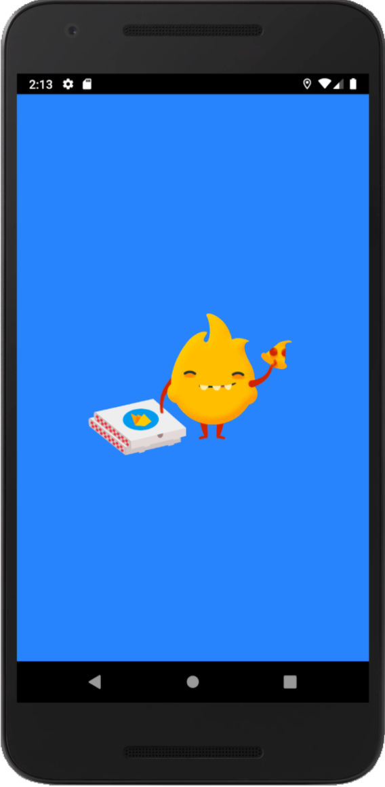

# Performance Monitoring for a Feature Rollout

This is the source code that accompanies the Firebase Performance Monitoring Codelab:
https://firebase.google.com/codelabs/feature-rollout-performance

The codelab will go over instrumenting traces to monitor the app’s performance,
rolling out a configuration change to users with Firebase Remote Config, monitoring the effect and seeing
how we can improve the performance.

To get started, import the project under the `firebase-perf-rc-android-start` directory.

If you don't want to do the codelab and would rather view the completed
sample code, see the finished code under the `firebase-perf-rc-android-finish` directory.
